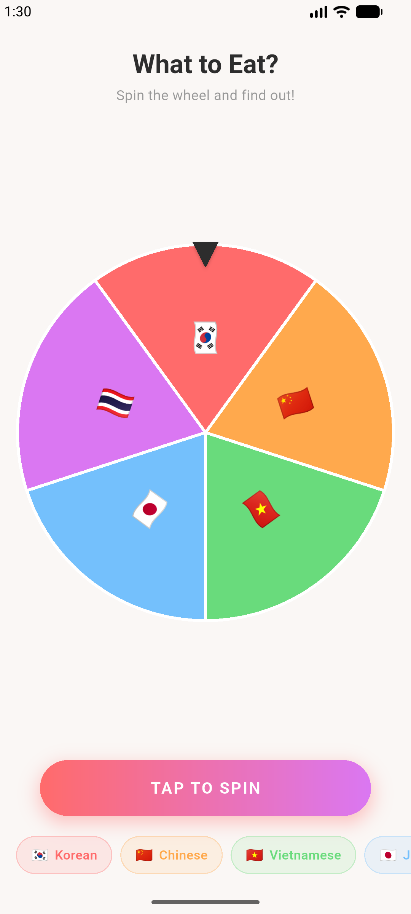
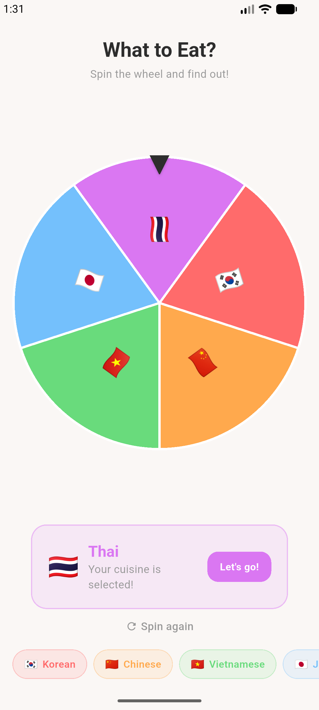
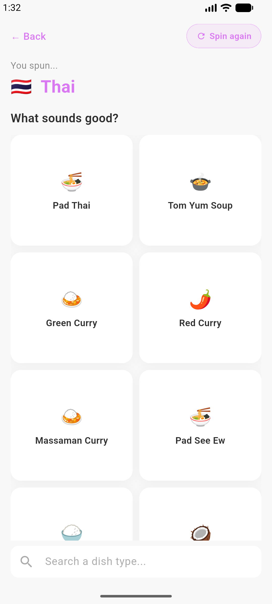
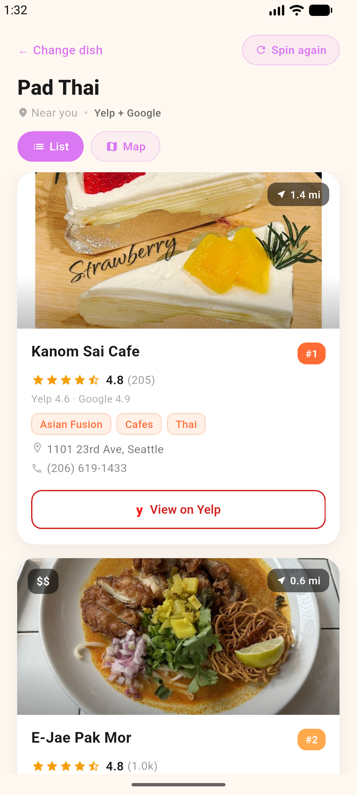
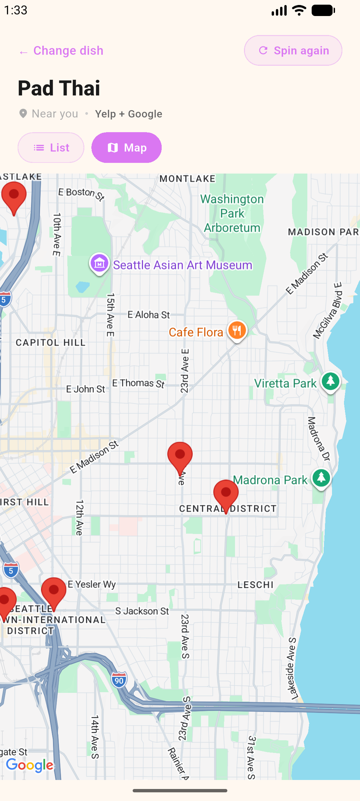
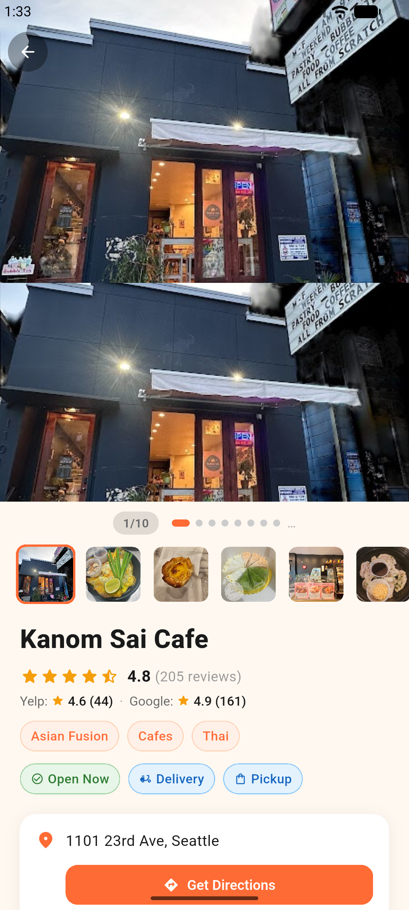

# Asian Flavor Spin

Spin the wheel, pick a cuisine, and find the best Asian restaurants near you!

Asian Flavor Spin makes choosing your next meal fun and easy. Spin the roulette wheel to randomly pick an Asian cuisine, browse popular dishes, and discover top-rated restaurants nearby with photos, reviews, and ratings from both Yelp and Google.

## Screenshots

<p align="center">
  
  
  
</p>
<p align="center">
  
  
  
</p>

## Features

- **Spin the Wheel** — randomly pick from 5 Asian cuisines: Korean, Japanese, Chinese, Vietnamese, and Thai
- **100+ Dishes** — browse popular dishes for each cuisine with descriptions and emojis
- **Restaurant Discovery** — find nearby restaurants with photos, ratings, and reviews
- **Combined Ratings** — aggregated scores from both Yelp and Google for accurate rankings
- **Map View** — see all restaurants on a map with interactive markers
- **Restaurant Details** — photo gallery with pinch-to-zoom, hours, reviews, directions, and call
- **Spin Again** — don't like the result? Spin again at any stage

## Tech Stack

- **Flutter** (Dart)
- **Yelp Fusion API** — restaurant search, photos, reviews, business details
- **Google Places API** — supplemental ratings and photos
- **Google Maps** — map view with markers
- **Geolocator** — device location

## Getting Started

### Prerequisites

- Flutter SDK 3.41+
- Android SDK / Xcode
- Yelp Fusion API key ([get one here](https://www.yelp.com/developers/v3/manage_app))
- Google Places API key ([get one here](https://console.cloud.google.com))

### Run the app

```bash
cd what_to_eat
flutter pub get
flutter run \
  --dart-define=YELP_API_KEY=your_yelp_key \
  --dart-define=PLACES_API_KEY=your_google_key
```

### Build for release

**Android APK:**
```bash
flutter build apk --release \
  --dart-define=YELP_API_KEY=your_yelp_key \
  --dart-define=PLACES_API_KEY=your_google_key
```

**Android App Bundle (Google Play):**
```bash
flutter build appbundle --release \
  --dart-define=YELP_API_KEY=your_yelp_key \
  --dart-define=PLACES_API_KEY=your_google_key
```

## Project Structure

```
what_to_eat/
├── lib/
│   ├── main.dart              # App entry point
│   ├── models/
│   │   ├── cuisine.dart       # Cuisine enum with dishes
│   │   ├── restaurant.dart    # Restaurant model
│   │   ├── restaurant_detail.dart
│   │   └── yelp_review.dart
│   ├── screens/
│   │   ├── spin_wheel_screen.dart
│   │   ├── dish_selection_screen.dart
│   │   ├── results_screen.dart
│   │   └── restaurant_detail_screen.dart
│   ├── services/
│   │   ├── location_service.dart
│   │   ├── places_service.dart
│   │   └── yelp_service.dart
│   └── widgets/
│       ├── restaurant_card.dart
│       └── photo_viewer.dart
└── store_assets/              # Play Store / Galaxy Store assets
```

## Privacy Policy

[View Privacy Policy](https://jjc98375.github.io/asian-flavor-spin-privacy/)

## License

All rights reserved.
